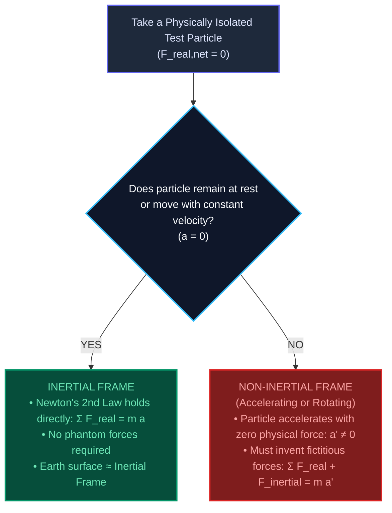
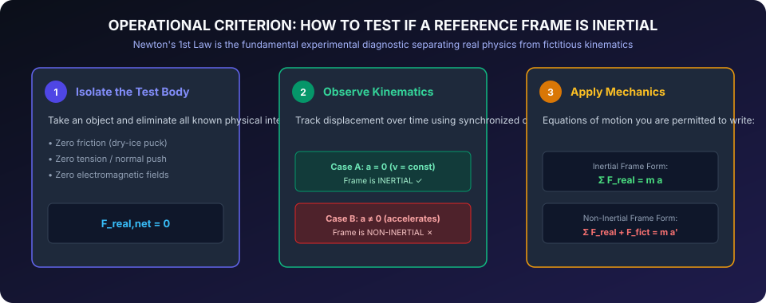
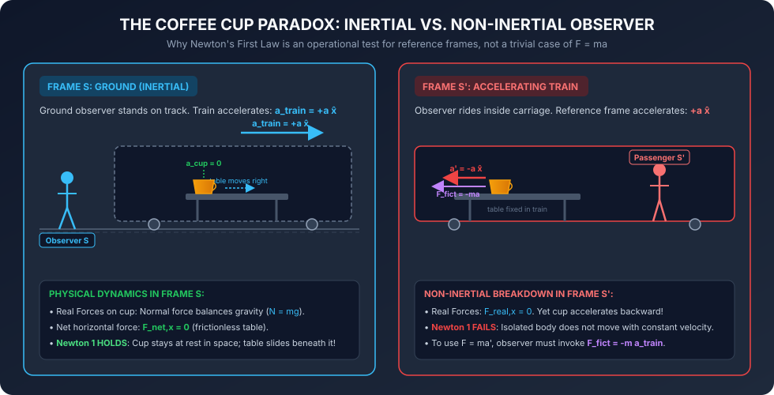
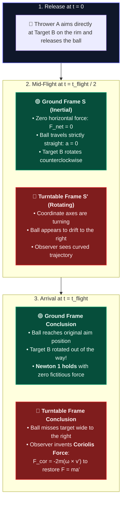

# Visual Guide: Inertial Reference Frames & Fictitious Forces

**Companion Guide to**: [01. Space, Time, and Inertial Reference Frames](../01_space_time_and_inertial_frames.md)  
**Primary References**: 
* Taylor, *Classical Mechanics*, Section 1.4 (pp. 13–16) & Chapter 9 (pp. 327–342)
* Feynman, *Lectures on Physics*, Vol. 1, Ch. 12 ("Characteristics of Force: Pseudo-forces")
* PSSC Classic Physics (1960), *Frames of Reference* (Hume & Ivey)

---

## 1. The Core Misconception: Why $F = 0 \implies a = 0$ is NOT Newton's First Law

Every introductory mechanics student initially asks:
> *"Why did Newton state the First Law as an independent axiom if it is just a special case of the Second Law?"*

$$
\text{If } \mathbf{F} = m\mathbf{a}, \quad \text{then } \mathbf{F} = \mathbf{0} \implies \mathbf{a} = \mathbf{0} \quad (\mathbf{v} = \text{constant}). \quad \text{Why did Newton need Law 1?}
$$

As Richard Feynman and John R. Taylor emphasize, **this is completely wrong**. 

$$\mathbf{F} = m\mathbf{a} \quad \text{is NOT valid in every coordinate system!}$$

If you sit in a car slamming on the brakes, an apple on the passenger seat suddenly shoots forward with violent acceleration, even though **no physical object is touching, pulling, or applying force to it**. 

Newton's First Law is not a formula; **it is an operational test to identify whether your coordinate system is valid for doing Newtonian physics**:

---

## 2. Visual Diagnosis: How to Test Any Reference Frame

---

## 3. Case Study 1: The Accelerating Train & The Coffee Cup

Imagine a train passenger observing a coffee cup on a frictionless table as the train accelerates down a straight track with constant acceleration $\mathbf{A} = +a\,\hat{\mathbf{x}}$.

### Two Observers, Two Explanations:

| Feature | Ground Observer (Inertial Frame $S$) | Train Passenger (Non-Inertial Frame $S'$) |
|---|---|---|
| **Relative State** | Stationary on track platform | Riding inside accelerating carriage |
| **Real Forces on Cup** | Normal force $\mathbf{N} = mg\,\hat{\mathbf{y}}$, Gravity $\mathbf{W} = -mg\,\hat{\mathbf{y}}$. $\mathbf{F}_{\text{real},x} = 0$. | Normal force $\mathbf{N} = mg\,\hat{\mathbf{y}}$, Gravity $\mathbf{W} = -mg\,\hat{\mathbf{y}}$. $\mathbf{F}_{\text{real},x} = 0$. |
| **Observed Motion** | The cup remains completely stationary in space ($\mathbf{a}_{\text{cup}} = \mathbf{0}$). The table slides out from beneath it. | The cup accelerates backward toward the caboose ($\mathbf{a}' = -a\,\hat{\mathbf{x}}$). |
| **Newton's 1st Law Status** | **HOLDS**: Zero net force yields zero acceleration. | **FAILS**: The cup accelerates spontaneously without any applied physical force! |
| **Equation of Motion** | $\sum \mathbf{F} = m\mathbf{a} \implies \mathbf{0} = m(\mathbf{0})$ | $m\mathbf{a}' = \sum \mathbf{F} + \mathbf{F}_{\text{inertial}} \implies m(-a\hat{\mathbf{x}}) = \mathbf{0} - ma\hat{\mathbf{x}}$ |

> [!NOTE]
> The fictitious force $\mathbf{F}_{\text{inertial}} = -m\mathbf{A}$ always points **opposite** to the acceleration of the reference frame and is proportional to the object's mass $m$. Because it scales with mass, all unsupported objects in the car accelerate backward at the identical rate $a$, indistinguishable from a gravitational field! (Einstein's Equivalence Principle).

---

## 4. Case Study 2: The Rotating Carousel & The Coriolis Force

When a reference frame rotates with angular velocity $\mathbf{\omega}$, the coordinate unit vectors themselves rotate over time. 

Suppose person A at the center of a counterclockwise-rotating turntable throws a ball toward person B stationed on the rim:

### Frame-by-Frame Timeline:

| Time Milestone | Ground Observer (Inertial Frame $S$) | Turntable Observer (Rotating Frame $S'$) |
|---|---|---|
| **$t = 0$ (Release)** | Ball released toward initial target position $B_0$. | Ball released toward target $B$ (appears directly ahead). |
| **$t = t_{\text{flight}}/2$ (Mid-Flight)** | Ball travels along a **straight line** ($\mathbf{a} = \mathbf{0}$). Rim target $B$ rotates CCW by $\Delta\theta = \frac{1}{2}\omega t$. | Ball appears to curve continuously to the right away from line of sight. |
| **$t = t_{\text{flight}}$ (Arrival)** | Ball passes through $B_0$. Target $B$ has rotated away. $\sum \mathbf{F} = \mathbf{0}$ correctly predicted the path. | Ball misses target $B$ wide right. Observer must invoke Coriolis force $\mathbf{F}_{\text{cor}} = -2m(\mathbf{\omega} \times \mathbf{v}')$ to explain the curve. |

### The Non-Inertial Equation of Motion for Rotating Frames
In Chapter 9, Taylor derives the exact transformation for a coordinate system rotating at constant $\mathbf{\omega}$:

$$
m\mathbf{a}' = \mathbf{F}_{\text{real}} + \underbrace{\mathbf{F}_{\text{cor}}}_{\text{Coriolis}} + \underbrace{\mathbf{F}_{\text{cf}}}_{\text{Centrifugal}}
$$

Where:
* **Coriolis Force**: $\mathbf{F}_{\text{cor}} = -2m(\mathbf{\omega} \times \mathbf{v}')$ *(acts perpendicular to the particle's velocity)*
* **Centrifugal Force**: $\mathbf{F}_{\text{cf}} = -m\mathbf{\omega} \times (\mathbf{\omega} \times \mathbf{r}')$ *(acts radially outward from the axis of rotation)*

---

## 5. Curated Video Demonstrations

These video demonstrations provide intuitive visual evidence of the distinction between inertial and non-inertial perspectives.

### 1. *Frames of Reference* (1960) — Hume & Ivey (University of Toronto / PSSC)
Widely recognized by physicists (including Feynman) as the finest visual exposition of reference frames ever produced.

> 🔗 **Watch Link**: [YouTube — Frames of Reference (1960, Full Film)](https://www.youtube.com/watch?v=bJMYoj4hHqU)  
> 🏛️ **Archive Link**: [Internet Archive (Public Domain)](https://archive.org/details/frames_of_reference)

**Key Timestamps for Study**:
* `0:00 – 3:30`: **The Inverted Perspective**: Demonstrator appears upside-down until the camera frame is revealed; demonstrates that all motion is relative.
* `4:45 – 7:50`: **The Dry-Ice Puck in an Accelerating Frame**: A frictionless puck on an accelerating table accelerates backward with no push; shows why Newton's 1st Law fails in an accelerating frame.
* `11:15 – 15:40`: **The Rotating Turntable**: A ball is rolled across a rotating table. An overhead camera (Inertial Frame) shows a straight line; a camera mounted to the turntable (Rotating Frame) shows a sharp curve.
* `18:30 – 23:10`: **Fictitious / Inertial Forces**: How an observer inside the accelerated frame can mathematically restore $\mathbf{F} = m\mathbf{a}$ by introducing fictitious forces.

---

### 2. Trajectories in Moving and Accelerating Reference Frames — Prof. Walter Lewin (MIT 8.01)

> 🔗 **Watch Link**: [MIT 8.01 / Walter Lewin: Trajectories in Moving & Accelerating Reference Frames](https://www.youtube.com/watch?v=FHtv3P1rUqg)

**Core Demonstration**:
* A cart moves along a track and launches a steel ball vertically upward:
  * **Constant Velocity Cart ($A = 0$, Inertial)**: The ball shares the cart's horizontal velocity $v_x$, describes a parabola relative to the lab, and **lands directly back into the cart**.
  * **Accelerating Cart ($A > 0$, Non-Inertial)**: The cart accelerates while the ball is airborne; the ball lands behind the launcher.

---

### 3. Coriolis Effect on a Playground Merry-Go-Round

> 🔗 **Watch Link**: [Real-Life Demonstration of the Coriolis Effect](https://www.youtube.com/watch?v=49JwbrXcPjc)

**What to Observe**:
* Two people sitting on opposite sides of a spinning carousel attempt to play catch with a soccer ball.
* From the fixed camera, the ball moves along a straight path.
* From the riders' perspective, the ball appears violently steered away into a curved arc by the Coriolis force.

---

## 6. Summary Comparison Table

| Property | Inertial Reference Frame | Non-Inertial Reference Frame |
|---|---|---|
| **Acceleration of Frame ($\mathbf{A}_{\text{frame}}$)** | $\mathbf{A}_{\text{frame}} = \mathbf{0}$ (at rest or constant velocity) | $\mathbf{A}_{\text{frame}} \neq \mathbf{0}$ (linear acceleration or rotation $\mathbf{\omega} \neq \mathbf{0}$) |
| **Newton's 1st Law** | **Always holds** ($\mathbf{F}_{\text{net}} = \mathbf{0} \implies \mathbf{a} = \mathbf{0}$) | **Violated** (isolated bodies accelerate spontaneously) |
| **Newton's 2nd Law** | $\sum \mathbf{F} = m\mathbf{a}$ | $\sum \mathbf{F} + \mathbf{F}_{\text{inertial}} = m\mathbf{a}'$ |
| **Origin of Forces** | Physical interactions (gravity, EM, contact) with identifiable source objects | Kinematic artifacts of the observer's own acceleration |
| **Newton's 3rd Law** | Every force has an equal and opposite reaction force | Fictitious forces have **no third-law partner** (no agent pushes back on the frame) |
| **Examples** | Deep space far from masses; Earth's surface (for non-rotational problems) | Accelerating elevator, turning car, rotating carousel, orbiting space station |
